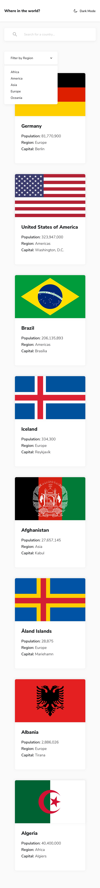
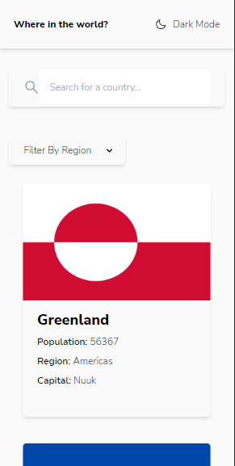

# Frontend Mentor - REST Countries API with color theme switcher solution

This is a solution to the [REST Countries API with color theme switcher challenge on Frontend Mentor](https://www.frontendmentor.io/challenges/rest-countries-api-with-color-theme-switcher-5cacc469fec04111f7b848ca). Frontend Mentor challenges help you improve your coding skills by building realistic projects.

## Table of contents

- [Overview](#overview)
  - [The challenge](#the-challenge)
  - [Screenshot](#screenshot)
  - [Links](#links)
- [My process](#my-process)
  - [Built with](#built-with)
  - [What I learned](#what-i-learned)
  - [Continued development](#continued-development)
  - [Useful resources](#useful-resources)
- [Author](#author)
- [Acknowledgments](#acknowledgments)

**Note: Delete this note and update the table of contents based on what sections you keep.**

## Overview

### The challenge

Users should be able to:

- See all countries from the API on the homepage
- Search for a country using an `input` field
- Filter countries by region
- Click on a country to see more detailed information on a separate page
- Click through to the border countries on the detail page
- Toggle the color scheme between light and dark mode _(optional)_

### Screenshot

<table>
<tr>
<td><b style="font-size:20px">Design</b></td>
<td><b style="font-size:20px">Desktop</b></td>
</tr>
<tr>
<td>
  
  
  
  
</td>
<td>
  
  
  
  
  
</td>
</tr>
<tr>
<td><b style="font-size:20px">Mobile Design</b></td>
<td><b style="font-size:20px">Mobile </b></td>
</tr>
<tr>
<td>
  
  
  
  
</td>
<td>
 
  
  
  
  
</td>
</tr>
<tr>
<td><b style="font-size:20px">Tablet</b></td>
</tr>
<tr>
<td>


</td>
</tr>

</table>

### Links

- Solution URL: [Github Repo](https://github.com/therahulchaurasia/Where-in-the-world)
- Live Site URL: [Netlify Hosting](https://countries-fm-rc.netlify.app)

## My process

### Built with

- Flexbox
- CSS Grid
- Mobile-first workflow
- [React](https://reactjs.org/) - JS library
- [TailwindCSS](https://tailwindcss.com/) - CSS Framework

### What I learned

I was able to pair up React and Tailwind together to create a powerful combination, which made this challenging project exciting and I learned a lot while building the web application. I was able to understand the features that hooks bring along with them as I created function-based components. I styled those components with Tailwind with reference to their documentation (which is a really helpful one). I was able to learn routing as well while building the application.

```
! Worth Mentioning !

The custom loader that [Loader.jsx].
The animation for the custom loader [tailwind.config.js]
```

### Continued development

One of the things I would like to do is to redirect to a different page when clicked on a border-country. Furthermore, I could improve some styles on the details page.

### Useful resources

- [Tailwind CSS](https://tailwindcss.com/) - Concise and clear documentation about tailwind which is beginner-friendly whereas can be used by a professional as well. I really like it and will use it going forward.
- [React Docs](https://reactjs.org/docs/getting-started.html) - To learn more about react.
- [MDN Docs](https://developer.mozilla.org/en-US/) - Looked for some object properties whild building the project.

## Author

- Frontend Mentor - [@therahulchaurasia](https://www.frontendmentor.io/profile/therahulchaurasia)
